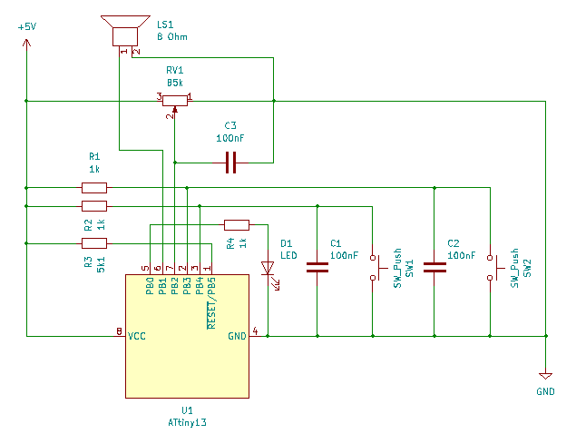

# AVR Metronome

This is a simple beeper that is supposed to be used as a metronome. It's goal is only to make regular beeps.
The the beeps come in series with the first one being slightly longer than the others (rhythm). The frequency
of the beeps can be controlled by a potentiometer and the number of beeps in the series by two buttons. There's
no display and probably very little accuracy. It's good enough for practising when the only thing needed is a
steady rhythm with no need for exact tempo.

The circuit is based on AVR Attiny 13 and made of things I found lying around so again -- not quite correct
electrically either.

The Makefile assumes USBAsp programmer and gcc 12
(with [this AVR specific bug](https://gcc.gnu.org/bugzilla/show_bug.cgi?id=105523)).

